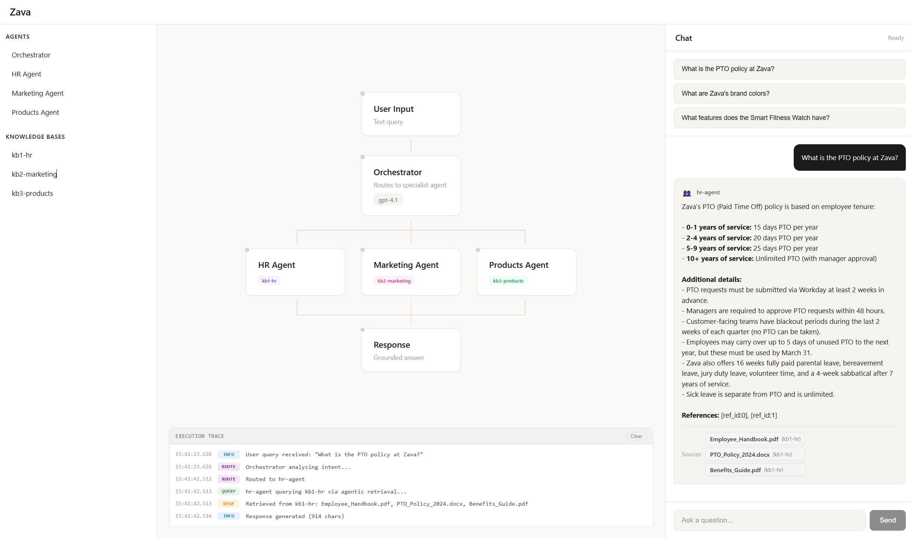

# FoundryIQ and Agent Framework Demo

A multi-agent orchestration demo using Microsoft Agent Framework SDK and Azure AI Foundry with FoundryIQ Knowledge Bases for grounded retrieval.



## Features

- **Multi-Agent Orchestration**: Intelligent routing of queries to specialized agents (HR, Products, Marketing)
- **Microsoft Agent Framework SDK**: Built on the official `agent-framework` Python SDK (including `agent-framework-azure-ai-search` for KB grounding)
- **FoundryIQ Knowledge Bases**: Agentic retrieval mode with gpt-4.1 for grounded responses
- **New Foundry Architecture**: Uses `CognitiveServices/accounts` (kind: AIServices) with child projects — no ML workspace hubs required
- **RBAC-Only Authentication**: No API keys — uses DefaultAzureCredential for all services
- **Fully Automated Deployment**: `azd up` provisions infrastructure, deploys models, creates indexes, and configures KBs

## Architecture

```
┌──────────────────────────────────────────────────────────────────────────────┐
│                              User Query                                       │
│                    "What is the PTO policy?"                                  │
└─────────────────────────────────┬────────────────────────────────────────────┘
                                  │
                                  ▼
┌──────────────────────────────────────────────────────────────────────────────┐
│                         ORCHESTRATOR AGENT                                    │
│                                                                               │
│   • Analyzes user intent                                                      │
│   • Routes to appropriate specialist agent                                    │
│   • Returns grounded response with citations                                  │
└───────────┬─────────────────────┬─────────────────────┬──────────────────────┘
            │                     │                     │
            ▼                     ▼                     ▼
┌───────────────────┐  ┌───────────────────┐  ┌───────────────────┐
│    HR AGENT       │  │  MARKETING AGENT  │  │  PRODUCTS AGENT   │
│                   │  │                   │  │                   │
│ kb1-hr            │  │ kb2-marketing     │  │ kb3-products      │
│ • PTO policies    │  │ • Campaigns       │  │ • Product catalog │
│ • Benefits        │  │ • Brand guidelines│  │ • Specifications  │
│ • Handbook        │  │ • Analytics       │  │ • Pricing         │
└─────────┬─────────┘  └─────────┬─────────┘  └─────────┬─────────┘
          │                      │                      │
          ▼                      ▼                      ▼
┌──────────────────────────────────────────────────────────────────────────────┐
│                  AZURE AI FOUNDRY (CognitiveServices/AIServices)              │
│  ┌────────────────────────────────────────────────────────────────────────┐  │
│  │  Project (CognitiveServices/accounts/projects)                         │  │
│  │  ┌──────────────┐    ┌──────────────┐    ┌──────────────┐              │  │
│  │  │   kb1-hr     │    │ kb2-marketing│    │ kb3-products │              │  │
│  │  │  gpt-4.1     │    │  gpt-4.1     │    │  gpt-4.1     │              │  │
│  │  └──────────────┘    └──────────────┘    └──────────────┘              │  │
│  └────────────────────────────────────────────────────────────────────────┘  │
└──────────────────────────────────────────────────────────────────────────────┘
```

## Prerequisites

- Azure subscription with Owner or Contributor + User Access Administrator
- [Azure CLI](https://learn.microsoft.com/cli/azure/install-azure-cli)
- [Azure Developer CLI (azd)](https://learn.microsoft.com/azure/developer/azure-developer-cli/install-azd)
- [Python 3.11+](https://www.python.org/downloads/)
- [Node.js 18+](https://nodejs.org/) (for building the frontend)

## Quick Start

### 1. Clone and Setup

```bash
git clone <repo-url>
cd FoundryIQ-Agent-Framework-demo

# Create virtual environment
python -m venv .venv
source .venv/bin/activate  # Linux/macOS
# .venv\Scripts\Activate.ps1  # Windows PowerShell

# Install dependencies
pip install -r requirements-dev.txt
pip install -r app/backend/requirements.txt
```

### 2. Deploy Everything

```bash
az login && azd auth login
azd up
```

`azd up` will:
1. Provision all Azure resources (AI Search, Storage, AIServices + Project, Container Apps)
2. Deploy gpt-4.1 to the AIServices resource
3. Run post-provision scripts (RBAC, indexes, knowledge sources, knowledge bases, sample data)
4. Build and deploy the backend + frontend

### 3. Environment Variables (auto-populated by azd)

After `azd up`, the following variables are set automatically in the Container App and in your local `azd` environment:

| Variable | Description |
|----------|-------------|
| `AZURE_AI_PROJECT_ENDPOINT` | Foundry project endpoint (`https://<ais>.services.ai.azure.com/api/projects/<proj>`) |
| `AZURE_SEARCH_ENDPOINT` | Azure AI Search endpoint (`https://<name>.search.windows.net/`) |
| `AZURE_OPENAI_DEPLOYMENT` | Model deployment name (default: `gpt-4.1`) |

### 4. Test the Orchestrator Locally

```bash
# Load azd env vars into your shell
eval $(azd env get-values | sed 's/^/export /')

python app/backend/agents/orchestrator.py
```

Try: "What is the PTO policy?" or "Tell me about the fitness watch"

## Project Structure

```
├── app/backend/agents/
│   ├── orchestrator.py      # Routes queries to specialists
│   ├── hr_agent.py          # HR specialist → kb1-hr
│   ├── products_agent.py    # Products specialist → kb3-products
│   └── marketing_agent.py   # Marketing specialist → kb2-marketing
├── infra/                   # Bicep IaC templates
├── scripts/                 # Setup and deployment scripts
└── docs/                    # Documentation
```

## Knowledge Base Mapping

| Agent | Knowledge Base | Content |
|-------|----------------|---------|
| HR | kb1-hr | PTO policies, benefits, handbook |
| Products | kb3-products | Product catalog, specs, pricing |
| Marketing | kb2-marketing | Campaigns, brand guidelines |

## Key Packages

| Package | Purpose |
|---------|---------|
| `agent-framework-core` | Core Agent Framework SDK |
| `agent-framework-azure-ai` | Azure AI Foundry integration |
| `agent-framework-azure-ai-search` | AzureAISearchContextProvider for KB grounding |

## Troubleshooting

| Issue | Fix |
|-------|-----|
| 403 Forbidden on Search | Portal → Search → Keys → "Both" |
| Generic responses (no grounding) | Ensure `context_provider` is passed to Agent |
| KB errors | Run `./scripts/setup_rbac.sh` |
| Missing env vars locally | Run `eval $(azd env get-values \| sed 's/^/export /')` |

## 📚 Learning Guides

Explore the [docs/guides/](docs/guides/) for hands-on tutorials and deep-dives:

| Guide | Description | Level |
|-------|-------------|-------|
| [Quick Start](docs/guides/01-quick-start.md) | Deploy end-to-end with `azd up` | 🟢 Beginner |
| [Architecture Overview](docs/guides/02-architecture-overview.md) | How the multi-agent system works | 🟢 Beginner |
| [Add a New Agent](docs/guides/03-add-new-agent.md) | Extend with a Finance agent | 🔵 Intermediate |
| [Customize Knowledge Bases](docs/guides/04-customize-knowledge-bases.md) | Replace sample data with your own | 🔵 Intermediate |
| [Prompt Engineering Lab](docs/guides/05-prompt-engineering-lab.md) | Experiment with prompts | 🔵 Intermediate |
| [Evaluate & Optimize](docs/guides/06-evaluate-optimize-agents.md) | Measure and improve quality | 🟣 Advanced |
| [Deploy Hosted Agents](docs/guides/07-deploy-hosted-agents.md) | Containerize for Foundry runtime | 🟣 Advanced |
| [Tracing & Observability](docs/guides/08-tracing-observability.md) | Monitor with App Insights | 🟣 Advanced |
| [Troubleshooting](docs/guides/09-troubleshooting.md) | Solutions for common issues | 🟠 Reference |
| [New Foundry vs Legacy](docs/guides/10-new-foundry-vs-legacy.md) | Migration from ML Hub | 🟠 Reference |

## License

MIT License
